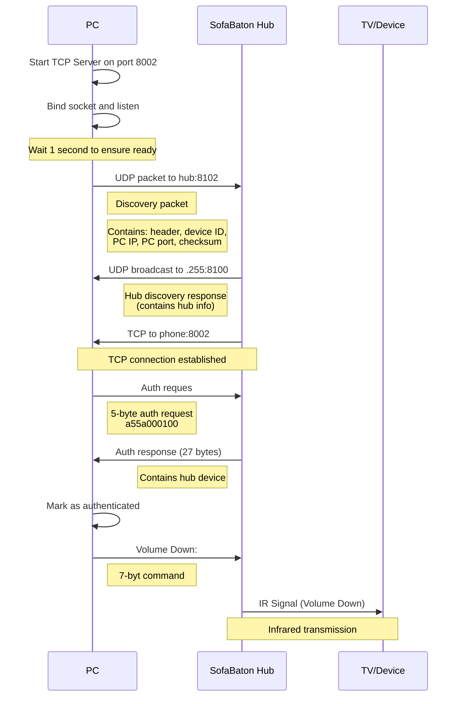

# SOFABATON Local API

In the absense of any official support from SofaBaton for local API access to the hub, this repo is an attempt to reverse engineed to access the hub.

## Binary protocol

1. Header: a55a
  * Standard SofaBaton packet header
  * Always starts with 0xA5, 0x5A
2. Length: 02
  - Indicates 2 bytes of command data follow
  - This is the data length, not total packet length
3. Command: c3
  - c3 - Discovery
3. Data
  - Command c3 - Discovery `a55a 0c c3 e0df 03862a23 c0a8283d 1f42 91`
    - Session Identifier: `e0df`
    - Device ID: `03862a23`
    - PC IP Address: `c0a8283d`
      - Hex version of each octet.  is `c0` is `192` `a8` = `168` etc...
    - PC Listeing Port: `1f42`
      - Port in Hex, ie `1f42` = `8002` 
  - Command 01 - Auth request `a55a 00 01 00`
  - Command 3F - Execute command `a55a 02 3f 02b6 f8`
    - Data: 02b6
4. Checksum:
  - Sum all the bytes and return low byte of the sum 
```py=
total = sum(b & 0xFF for b in data) # Sum all bytes as unsigned
return total & 0xFF # Return only the low byte of the sum
```
### Sequence flow diagram


  The 0.5-second delay mimics how a user would press a volume button multiple times. Try it and see if you get the expected volume down behavior!

> ok can you break down the volume down command

● Absolutely! Let me break down the volume down command byte by byte:

  Volume Down Command: a55a023f02b9fb

  a5 5a 02 3f 02 b9 fb
  │  │  │  │  │  │  │
  │  │  │  │  │  │  └── Checksum (0xFB)
  │  │  │  │  │  └───── Command Data 2 (0xB9)
  │  │  │  │  └──────── Command Data 1 (0x02)
  │  │  │  └─────────── Command Type (0x3F)
  │  │  └────────────── Length (0x02 = 2 bytes of data)
  │  └───────────────── Header byte 2 (0x5A)
  └──────────────────── Header byte 1 (0xA5)

  Detailed Breakdown:

  1. Header: a55a
    - Standard SofaBaton packet header
    - Always starts with 0xA5, 0x5A
  2. Length: 02
    - Indicates 2 bytes of command data follow
    - This is the data length, not total packet length
  3. Command Type: 3f
    - 0x3F (63 decimal) = Volume control command
    - This tells the hub this is a volume-related operation
  4. Command Data: 02b9
    - 02 = Sub-command (volume operation)
    - b9 = Volume Down (specific action)
    - Compare to Volume Up: 02b6 (0xB6 vs 0xB9)
  5. Checksum: fb
    - 0xFB = Validation byte
    - Calculated from all previous bytes

  Volume Up vs Volume Down Comparison:

  | Command     | Packet         | Command Data | Action Byte |
  |-------------|----------------|--------------|-------------|
  | Volume Up   | a55a023f02b6f8 | 02b6         | b6          |
  | Volume Down | a55a023f02b9fb | 02b9         | b9          |

  The only difference is:
  - Volume Up: b6 (182 decimal)
  - Volume Down: b9 (185 decimal)
  - Different checksums due to the changed byte

  This suggests other IR commands might follow the same pattern with different action bytes in the b6/b9 position.

