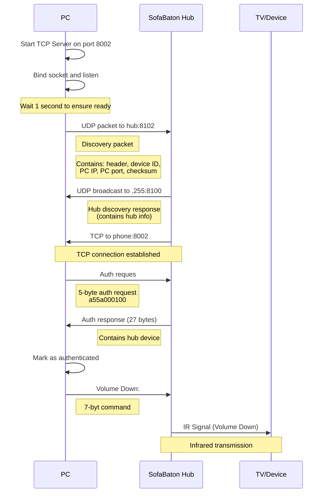

# SOFABATON Local API

In the absense of any official support from SofaBaton for local API access to the hub, this repo is an attempt to reverse engineed to access the hub.

## Binary protocol

1. Header: a55a
  * Standard SofaBaton packet header
  * Always starts with 0xA5, 0x5A
2. Length: 02
  - Indicates 2 bytes of command data follow
  - This is the data length, not total packet length
3. Command: c3
  - c3 - Discovery
3. Data
  - Command c3 - Discovery `a55a 0c c3 e0df 03862a23 c0a8283d 1f42 91`
    - Session Identifier: `e0df`
    - Device ID: `03862a23`
    - PC IP Address: `c0a8283d`
      - Hex version of each octet.  is `c0` is `192` `a8` = `168` etc...
    - PC Listeing Port: `1f42`
      - Port in Hex, ie `1f42` = `8002` 
  - Command 01 - Auth request `a55a 00 01 00`
  - Command 3F - Execute command `a55a 02 3f 02b6 f8`
    - Device ID: 02
    - Key
      - b6 - Volume Up
      - b9 - Volume Down 
4. Checksum:
  - Sum all the bytes and return low byte of the sum 
```py=
total = sum(b & 0xFF for b in data) # Sum all bytes as unsigned
return total & 0xFF # Return only the low byte of the sum
```
### Sequence flow diagram


